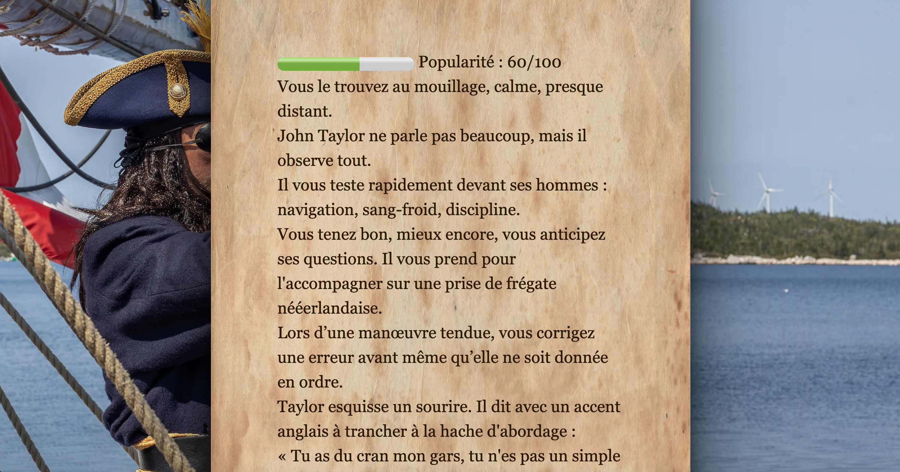
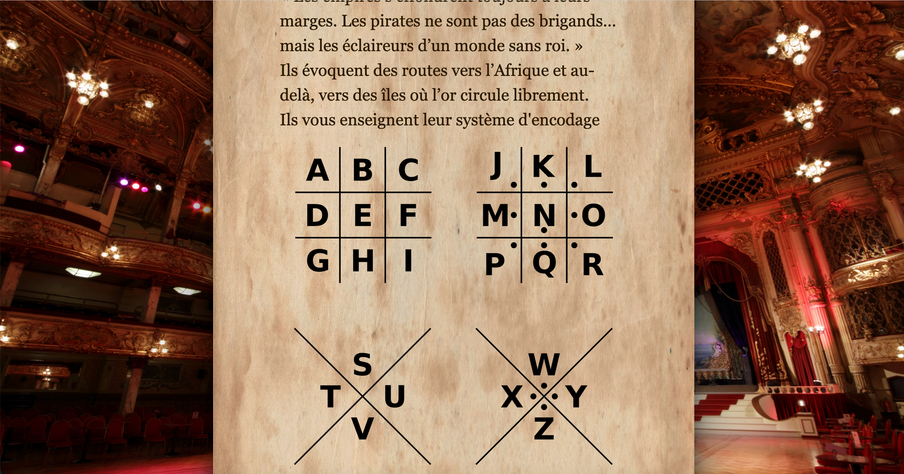

# Fiction interactive : Olivier Levasseur

Entre faits historiques, théories, imaginaires et références de culture populaire, retracez la vie du pirate légendaire qui inspira *One Piece* : **Olivier Levasseur**.

## Sources

Les principales sources d’informations sont basées sur les travaux de **Cyrille Lougnon** et **Jean Soulat**.  
*One Piece* est également un moteur d’inspiration.

## Compatibilité

Le jeu fonctionne mieux sur **Twine** mais est jouable dans le navigateur via le fichier HTML.

## Fonctionnalités interactives

- **Compétences** à apprendre en passant par certains passages pour décoder le cryptogramme.
- **Réputation** à gérer dans l’océan Indien.
- Le fait qu’on n’ait pas le fin mot de l’histoire concernant le trésor d’Olivier Levasseur (qui, lui, est avéré) permet une certaine liberté scénaristique.  
  Le joueur explore les théories les plus plausibles scientifiquement à la fin.
- Nombreuses **références culture pop** cachées dans le jeu.

## Modules, librairies et scripts intégrés

- **Twine 2** (Harlowe) : moteur de narration interactive.

## Installation et Lancement

1. Téléchargez le fichier `index.html` depuis le dépôt ou [itch.io](https://admirzheng.itch.io/levasseur).
2. Ouvrez-le dans le navigateur.

## Progression et transformation

L’aspect de la transformation vient de la progression et des chemins qui mènent à la piraterie.  
À l’époque, la frontière entre marchand, officier et pirate n’était pas si nette.

## Contexte académique

Jeu réalisé dans le cadre du cours de **Développement de Jeu-Vidéo 2D** de **Loïc Cattani**,  
**Université de Lausanne**.

## Crédits

### Musique

Sons provenant de [Pixabay](https://pixabay.com/) :

- [Audio 1](https://cdn.pixabay.com/download/audio/2023/09/24/audio_70e3d3e84e.mp3?filename=...)
- [Audio 2](https://cdn.pixabay.com/download/audio/2025/10/14/audio_8b660627a9.mp3?filename=...)
- [Audio 3](https://cdn.pixabay.com/download/audio/2025/07/18/audio_4ad7dc5e51.mp3?filename=...)
- [Audio 4](https://cdn.pixabay.com/download/audio/2025/07/12/audio_7adac34d51.mp3?filename=...)
- [Audio 5](https://cdn.pixabay.com/download/audio/2025/04/23/audio_57cdc86804.mp3?filename=...)
- [Audio 6](https://cdn.pixabay.com/download/audio/2025/02/14/audio_06c9c3aeb1.mp3?filename=...)
- [Audio 7](https://cdn.pixabay.com/download/audio/2025/06/18/audio_dee743deb6.mp3?filename=...)

### Images de fond

- [Image 1](https://images.pexels.com/photos/29823906/pexels-photo-29823906.jpeg?_gl=11bcuctl_gaODc0MTk0NjE1LjE3ODIyOTE0Mjg._ga_8JE65Q40S6*czE3ODIyOTE0MjckbzEkZzEkdDE3ODIyOTI1NTgkajQ0JGwwJGgw)
- [Image 2](https://images.pexels.com/photos/12158581/pexels-photo-12158581.jpeg?_gl=1*1ix29k3*_gaODc0MTk0NjE1LjE3ODIyOTE0Mjg._ga_8JE65Q40S6*czE3ODIyOTE0MjckbzEkZzEkdDE3ODIyOTIzNjQkajU5JGwwJGgw)
-[Image 3](https://images.pexels.com/photos/16588033/pexels-photo-16588033.jpeg?_gl=114av5nn_gaODc0MTk0NjE1LjE3ODIyOTE0Mjg._ga_8JE65Q40S6*czE3ODIyOTE0MjckbzEkZzEkdDE3ODIyOTI1MDckajMyJGwwJGgw)
- [Image 4](https://images.pexels.com/photos/9764167/pexels-photo-9764167.jpeg?_gl=1a47smp_gaODc0MTk0NjE1LjE3ODIyOTE0Mjg._ga_8JE65Q40S6*czE3ODIyOTE0MjckbzEkZzEkdDE3ODIyOTI2MjIkajQxJGwwJGgw)
- [Image 5](https://images.pexels.com/photos/31270195/pexels-photo-31270195.jpeg?_gl=1*178chm5*_gaODc0MTk0NjE1LjE3ODIyOTE0Mjg._ga_8JE65Q40S6*czE3ODIyOTE0MjckbzEkZzEkdDE3ODIyOTI2ODIkajQ3JGwwJGgw)
- [Image 6](https://images.pexels.com/photos/9390981/pexels-photo-9390981.jpeg?_gl=11ea74sy_gaODc0MTk0NjE1LjE3ODIyOTE0Mjg._ga_8JE65Q40S6*czE3ODIyOTE0MjckbzEkZzEkdDE3ODIyOTMwNDUkajM1JGwwJGgw)
- [Image 7](https://upload.wikimedia.org/wikipedia/commons/thumb/3/33/Le_roi_Louis_XVIII_dans_son_cabinet_de_travail_des_Tuileries_%28bgw17_0044%29.jpg/3840px-Le_roi_Louis_XVIII_dans_son_cabinet_de_travail_des_Tuileries_%28bgw17_0044%29.jpg)
- [Image 8](https://images.pexels.com/photos/9267432/pexels-photo-9267432.jpeg?_gl=1*1ksuhm0*_gaODc0MTk0NjE1LjE3ODIyOTE0Mjg._ga_8JE65Q40S6*czE3ODIyOTE0MjckbzEkZzEkdDE3ODIyOTMxMTgkajM3JGwwJGgw)
- [Image 9](https://images.pexels.com/photos/12028282/pexels-photo-12028282.jpeg?_gl=11fu47mu_gaODc0MTk0NjE1LjE3ODIyOTE0Mjg._ga_8JE65Q40S6*czE3ODIyOTE0MjckbzEkZzEkdDE3ODIyOTMyMTgkajU5JGwwJGgw)
- [Image 10](https://images.pexels.com/photos/5048704/pexels-photo-5048704.jpeg?_gl=1*1s8bu36*_gaODc0MTk0NjE1LjE3ODIyOTE0Mjg._ga_8JE65Q40S6*czE3ODIyOTE0MjckbzEkZzEkdDE3ODIyOTMyNjUkajEyJGwwJGgw)
- [Image 11](https://images.pexels.com/photos/32544307/pexels-photo-32544307.jpeg?_gl=110th13r_gaODc0MTk0NjE1LjE3ODIyOTE0Mjg._ga_8JE65Q40S6*czE3ODIyOTE0MjckbzEkZzEkdDE3ODIyOTMzMTYkajMyJGwwJGgw)
- [Image 12](https://www.papierpeintpanoramique.ch/media/catalog/product/cache/871f459736130e239a3f5e6472128962/w/0/w04826-small.jpg)
- [Image 13](https://images.pexels.com/photos/13280841/pexels-photo-13280841.jpeg?_gl=11rvycbr_gaODc0MTk0NjE1LjE3ODIyOTE0Mjg._ga_8JE65Q40S6*czE3ODIyOTE0MjckbzEkZzEkdDE3ODIyOTMzOTckajEzJGwwJGgw)
- [Image 14](https://images.pexels.com/photos/27920690/pexels-photo-27920690.jpeg?_gl=1cqh8j4_gaODc0MTk0NjE1LjE3ODIyOTE0Mjg._ga_8JE65Q40S6*czE3ODIyOTE0MjckbzEkZzEkdDE3ODIyOTM0ODYkajU5JGwwJGgw)
- [Image 15](https://images.pexels.com/photos/5486345/pexels-photo-5486345.jpeg?_gl=115773sn_gaODc0MTk0NjE1LjE3ODIyOTE0Mjg._ga_8JE65Q40S6*czE3ODIyOTE0MjckbzEkZzEkdDE3ODIyOTM1NzQkajM5JGwwJGgw)
- [Image 16](https://images.pexels.com/photos/28829985/pexels-photo-28829985.jpeg?_gl=119tc9id_gaODc0MTk0NjE1LjE3ODIyOTE0Mjg._ga_8JE65Q40S6*czE3ODIyOTE0MjckbzEkZzEkdDE3ODIyOTM2ODMkajM4JGwwJGgw) (tag taylor)
- [Image 17](https://images.pexels.com/photos/15688904/pexels-photo-15688904.jpeg?_gl=1*6xuwu5*_gaODc0MTk0NjE1LjE3ODIyOTE0Mjg._ga_8JE65Q40S6*czE3ODIyOTE0MjckbzEkZzEkdDE3ODIyOTM3MjQkajU5JGwwJGgw)
- [Image 18](https://images.pexels.com/photos/32772137/pexels-photo-32772137.jpeg?_gl=1*1nvisr0*_gaODc0MTk0NjE1LjE3ODIyOTE0Mjg._ga_8JE65Q40S6*czE3ODIyOTE0MjckbzEkZzEkdDE3ODIyOTM4MzUkajIyJGwwJGgw)
- [Image 19](https://images.pexels.com/photos/27409011/pexels-photo-27409011.jpeg?_gl=1v3z25i_gaODc0MTk0NjE1LjE3ODIyOTE0Mjg._ga_8JE65Q40S6*czE3ODIyOTE0MjckbzEkZzEkdDE3ODIyOTM3NzQkajkkbDAkaDA.)
- [Image 20](https://images.pexels.com/photos/5736615/pexels-photo-5736615.jpeg?_gl=1bl3ua0_gaODc0MTk0NjE1LjE3ODIyOTE0Mjg._ga_8JE65Q40S6*czE3ODIyOTE0MjckbzEkZzEkdDE3ODIyOTM4OTIkajQ1JGwwJGgw)
- [Image 21](https://images.pexels.com/photos/5022680/pexels-photo-5022680.jpeg?_gl=1v4o4hs_gaODc0MTk0NjE1LjE3ODIyOTE0Mjg._ga_8JE65Q40S6*czE3ODIyOTE0MjckbzEkZzEkdDE3ODIyOTM5OTIkajIzJGwwJGgw)
- [Image 22](https://upload.wikimedia.org/wikipedia/commons/thumb/8/84/Nicholas_Cammillieri_-_Combat_du_Corsaire_%27La_Mouche%27_%28cropped%29.jpg/960px-Nicholas_Cammillieri_-_Combat_du_Corsaire_%27La_Mouche%27_%28cropped%29.jpg)
- [Image 23](https://images.pexels.com/photos/15657950/pexels-photo-15657950.jpeg?_gl=1shahtf_gaODc0MTk0NjE1LjE3ODIyOTE0Mjg._ga_8JE65Q40S6*czE3ODIyOTE0MjckbzEkZzEkdDE3ODIyOTQwOTQkajQyJGwwJGgw) (URL isolée entre les règles)
- [Image 24](https://upload.wikimedia.org/wikipedia/commons/thumb/1/12/Pirate_ships_in_battle.jpg/960px-Pirate_ships_in_battle.jpg)
- [Image 25](https://images.pexels.com/photos/28829985/pexels-photo-28829985.jpeg?_gl=119tc9id_gaODc0MTk0NjE1LjE3ODIyOTE0Mjg._ga_8JE65Q40S6*czE3ODIyOTE0MjckbzEkZzEkdDE3ODIyOTM2ODMkajM4JGwwJGgw) (doublon exact de l’Image 16 – tag taylor répété)
- [Image 26](https://upload.wikimedia.org/wikipedia/commons/thumb/0/05/Bardo_National_Museum_%28Tunis%29_29.jpg/960px-Bardo_National_Museum_%28Tunis%29_29.jpg)
- [Image 27](https://upload.wikimedia.org/wikipedia/commons/thumb/d/db/Pirates_vs_Dutch_Navy.jpg/960px-Pirates_vs_Dutch_Navy.jpg)
- [Image 28](https://upload.wikimedia.org/wikipedia/commons/thumb/a/ac/HMS_Bounty.jpg/960px-HMS_Bounty.jpg)
- [Image 29](https://images.pexels.com/photos/15657950/pexels-photo-15657950.jpeg?_gl=114c98xb_gaODc0MTk0NjE1LjE3ODIyOTE0Mjg._ga_8JE65Q40S6*czE3ODIyOTE0MjckbzEkZzEkdDE3ODIyOTU1MDgkajU5JGwwJGgw) (tag equip)
- [Image 30](https://upload.wikimedia.org/wikipedia/commons/thumb/1/15/Hogarth_the_idle_%27prentice.jpg/960px-Hogarth_the_idle_%27prentice.jpg)
- [Image 31](https://upload.wikimedia.org/wikipedia/commons/thumb/c/c9/Execution_of_pirate_chief.jpg/960px-Execution_of_pirate_chief.jpg)
- [Image 32](https://images.pexels.com/photos/12875324/pexels-photo-12875324.jpeg?_gl=1*1wraki1*_gaODc0MTk0NjE1LjE3ODIyOTE0Mjg._ga_8JE65Q40S6*czE3ODIyOTE0MjckbzEkZzEkdDE3ODIyOTczNTYkajMwJGwwJGgw)

### Parchemin (fond)

- [Parchemin texture](https://images.pexels.com/photos/16557322/pexels-photo-16557322.jpeg?_gl=1dx5bwg_gaODc0MTk0NjE1LjE3ODIyOTE0Mjg._ga_8JE65Q40S6*czE3ODIyOTE0MjckbzEkZzEkdDE3ODIyOTY5MDIkajIkbDAkaDA)

## Recours aux LLM 

**Aucun LLM (Large Language Model) n'a été utilisé** pour la conception, le développement ou la rédaction de ce projet. Utilisation de Deepseek pour la mise en page du readme.md. 

### Lien itch.io

### captures d'écran

